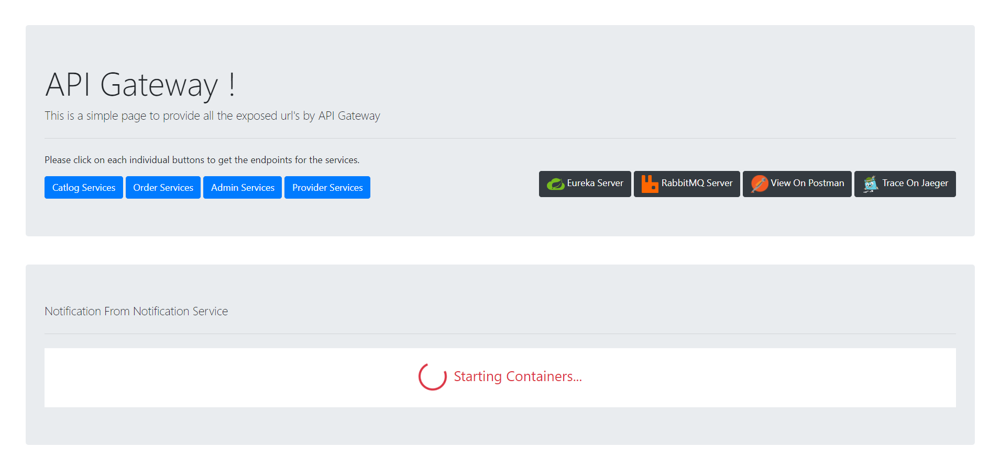

# .Net Microservices Home Service Application (UrbanClap) Backend
Sample Application to understand the basic concepts of containers, gateways, service discovery and Distributed tracing

## Getting Started

Make sure you have Docker [installed](https://docs.docker.com/docker-for-windows/install/)
